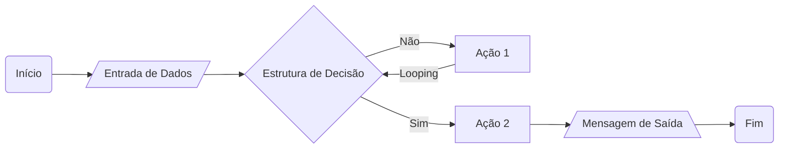
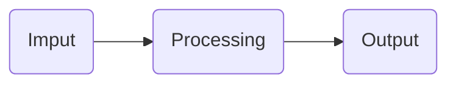

# Materiais Complementares
[Mapa] https://helpful-jump-17b.notion.site/Mapa-de-aventura-91f3e9bd923842149d4dba754dc65c07  
[Artigos DIO] https://web.dio.me/articles  
[Stack Overflow] https://stackoverflow.com  
# Entendendo Algoritmos e Fluxogramas
## Sobre Algoritmos
- **Algorítimos:** são os passo a passo lógicos que o computador precisa executar para resolver um problema.
- A ordem dos fatores **altera** o produto
- A primeira etapa é saber qual problema você quer resolver.
## Fluxogramas
- **Fluxograma:** é uma representação visual de uma sequência de ações.
-  Precisa ter um **início** e um **fim**, por padrão usa-se bordas arredondadas nesses casos.
-  Para **entrada de dados** usa-se um paralelogramo inclinado.
-  Para **estrutura de decisisão** usa-se um losângulo.
-  Para **ações** usa-se um retângulo.
-  Para **mensagens de saída** usa-se um paralelogramo base de pirâmide.


# Estrutura de um Software e seus componentes
**Todo o aplicativo tem esses 3 momentos:**

## Features
Cada **Feature** é uma funcionalidade do programa.  
Cada **Feature** é um fluxo de Imput -> Processing -> Output
## Estrutura do Programa
- **let** usado para declarar uma variável.
- **const** usado para declarar uma constante
- **//** usado para comentar
- **+** usado para concatenar  
*Uma constante não pode ter seu valor alterad0*
## Tipos de Variáveis
- **string:** texto
- **number:** números
- **boolean:** variáveis lógicas que guardam 2 estados (verdadeiro ou falso)
*JavaScript é uma linguágem não tipável (você não precisa declarar o tipo da variável na hora que cria ela)*  
*Na informática, qualquer número que não seja usado para operações deve ser guardado como texto por boa prática*
# Criando e manipulando vetores e matrizes
## Arrays (Vetores)
```let array = ["nome 1","Nome 2" , "Nome 3"]```
### Posições
As posições começam do 0 e não do 1, são colocadas em **[ ]**.  
```console.log(array[0])```  
**Existem vantagens em usar vetores**  
- Vetores possuem funções e recursos de acordo com a linguagem usada.
- Essas funções dos vetores são chamadas de **métodos**
## Matrizes 
Matrizes são vetores de duas ou mais dimensões.  
São montadas colocando um vetor dentro do outro.  
Seus valores podem ser listados por completo (o array inteiro), ou campos individuais.  
*Assim como arrays, matrizes também possuem funções*

```
let matriz = [
["Nome4","M",3],
["Nome5","F",2],
["Nome6","f",4],
]
```
```
console.log("o nome " + matriz[2][0] + " é do sexo "+matriz[2][1]+" e tem número "+matriz[2][2])
```
## Quando usar qual?
- **Variáveis e constantes:** Quando precisa usar apenas uma informação.
- **Arrays:** Quando forem várias informações do mesmo tipo.
- **Matrizes:** Quando forem várias informações de tipos diferentes.    
### Matrizes e Vetores possuem:
- **Métodos:** são funções.
- **Propriedades:** são informações  
# Entendendo Operadores
## Operadores e Expressões
### Operadores Artméticos
**- Escopo:** É aquilo que está entre parênteses.
| **Operador** | **Descrição** | **Exemplo** |
| --- | --- | --- |
| + | Adição | **`let result = 5 + 3;`** |
| - | Subtração | **`let result = 8 - 2;`** |
| * | Multiplicação | **`let result = 4 * 6;`** |
| / | Divisão | **`let result = 10 / 2;`** |
| % | Módulo (resto da divisão) | **`let result = 10 % 3;`** |

### Operadores Relacionais
| **Operador** | **Descrição** | **Exemplo** |
| --- | --- | --- |
| == | Igual a (compara valor) | **`let isEqual = (x == y);`** |
| === | Igual a (compara valor e formato)| **Exemplo: 1 e "1"**|  
| != | Diferente de | **`let isNotEqual = (x != y);`** |
| > | Maior que | **`let isGreater = (x > y);`** |
| < | Menor que | **`let isLess = (x < y);`** |
| >= | Maior ou igual a | **`let isGreaterOrEqual = (x >= y);`** |
| <= | Menor ou igual a | **`let isLessOrEqual = (x <= y);`** |

### Operadores Lógicos

| **Operador** | **Descrição** | **Exemplo** |
| --- | --- | --- |
| && | AND lógico | **`if (condition1 && condition2)`** |
| \|\| | OR lógico | **`if (condition1 \|\| condition2)`** |
| ! | NOT lógico | **`if (!condition)`** |

### Operadores de Atribuição
|Operador	|Descrição	|Exemplo|
|---|---|---|
|=	|Atribuição	|**`let x = 5;`**
|+=	|Adição e atribuição	|**`let num = 10; num += 2;`**
|-=	|Subtração e atribuição	|**`let num = 10; num -= 3;`**
|*=	|Multiplicação e atribuição	|**`let num = 5; num \*= 4;`**
|/=	|Divisão e atribuição	|**`let num = 10; num /= 2;`**
|%=	|Módulo e atribuição	|**`let num = 10; num %= 3;`**
### Operadores de Incremento e Decremento
|Operador	|Descrição	|Exemplo
|---|---|---|
|++|	Incremento	|**`let counter = 0; counter++;`**
|--|	Decremento	|**`let counter = 5; counter--;`**

# Estruturas de Controle
## Estruturas Condicionais
### IF
Verifica se a condição entre parênteses é `true`, se for executa oi código entre `{ }`.
```
if (condição == true) { Faça isso }
```
### ELSE
Caso a condição do if seja `false`, executará o código entre `{ }` do else.
```
if (condição == true) { Faça isso }
    else {faça esse outro}

```
### ELSE IF
Usado para adicionar novas perguntas dentro de um IF, também é chamado de IF sequencial.
```
if (condição == true) { Faça isso }
    else if (condição == true) { Faça esse outro} 
    else {faça isso então}
```
## Estruturas de Decisão
### Switch Case
Verifica se uma informação é verdadeira, se for executa tudo o que estiver abaixo, no bloco, ou até o comando break.
let dia = "terça"; // Você pode mudar isso para outros dias
```
switch (dia) {
  case "segunda":
    console.log("Dia de começar a semana com energia!");
    break;
  case "terça":
    console.log("Hora de aprender coisas novas!");
    break;
  case "quarta":
    console.log("Metade da semana, continue firme!");
    break;
  case "quinta":
    console.log("Quase lá, um pouco mais de esforço!");
    break;
  case "sexta":
    console.log("Dia de comemorar, o fim de semana está chegando!");
    break;
  default:
    console.log("Final de semana! Descanse e divirta-se!");
}
```
#### Break
Usado para fazer com que o switch seja termidado sem prosseguir para os comandos seguintes.
#### Default: 
Caso nenhum **`case`** tenha sido executado este bloco será executado.  
Não precisa estar no final do `switch`.
### mais de uma palavra para um bloco de código
É possível adicionar mais de um case para um bloco de código:  
```
switch (dia) {
  case "morango":
  case "mamao"
    console.log("será ativado com qualquer das palavras, morango ou mamão!");
    break;
}
```
## Estruturas de Repetição
### For
É usado para executar um bloco de código várias vezes, de acordo com uma condição pré estabelecida.  
O **i++** é executado após o bloco de código.  
No caso abaixo ele irá mostrar o valor na posição 0 do vetor e depois transformará o **i em 1**.
```
const numeros =[1,2,3,4,5]

for (let i=0 ; i < numeros.length; i++){
  console.log(numeros[i])
}
```
### While
O laço while é usado quando não sabemos quantas vezes precisamos executar um bloco de código. Enquanto a condição for verdadeira ele é executado, **é importante não esquecer de colocar um contador ou condição de saída no bloco de código**.  
```
let jogadas = 0;
let cara = false;

while(!cara) {
  jogadas++;
  cara = Math.random() < 0.5;
}

console.log(`A moeda caiu cara após ${jogadas} jogadas!`);
```
### Do While
O laço do-while é um laço de repetição `while` que sempre executa o bloco de código ao menos uma vez.
```
let contador = 1
do {
  console.log("Olá")
  contador ++
} while (contador <3)
```
# Funções
- Uma função representa uma ação.  
- Uma função sempre abre e fecha parênteses.  
- Ela pode ou não receber um parâmetro de entrada e pode - ou não ter uma saída, mas sem pre terá uma ação.  
- O que está entre chaves em uma função é chamado de - escopo.  
- Uma função precisa ser chamada para executar.  
**Atenção**
- Assim como variáveis: nomes de funçõs não começam com números.
- Usar camelCase.
- Funções são ações, então é bom nomeá-las com verbos.
- Por boa prática: **Cada função deve fazer uma única coisa**.  
- **Função Main( ):** é uma função responsável por chamar as demais funções.
- A identação é bem importante para melhor visualizar o código em funções.
- Uma declaração de função cria uma função, enquanto uma chamada de função executa o código dentro dela.  

## Parâmetros
Uma função pode receber um ou mais parâmetros, eles são passados ao invocar a função e assumem o parâmetro no cabeçalho da função.  
Geralmente se passa parâmtros quando se quer que a função tenha resultados diferentes.  
### Valor padrão
É possível passar um valor padrão em uma função, usado caso a função não recebe um dos parâmetros, no exemplo abaixo é o "cliente".  
O valor padrão só é usado caso a função não receba um valor no parâmetro esperado.  
Não é possível deixar 2 vírgulas grudadas na passagem de parâmentros, então é importante deixar as opcionais (que podem usar um valor padrão no fim).
```
torrar("Pão Integral","Anita")
function torrar (pao,nome = "cliente"){
  console.log("Torrada feita com " + pao)
  console.log(" Pedido feito por "+nome)
}

```
## Escopo
O Escopo de uma função é determinado pelo conjunto de chaves dela.  
Variáveis fora dela não são reconhecidas, pois estão fora das chaves.  
### var
Existe a opção de declarar uma variável global, ao invés de usar o let  ou const usa-se **`var`**.  
**Essa não é uma prática recomendada, pois equivale a uma variável estar disponível publicamente (ou vazendo) pelo sistema**
## Funções com retorno
Uma função pode retornar **apenas** **um** valor ou **um** objeto.
