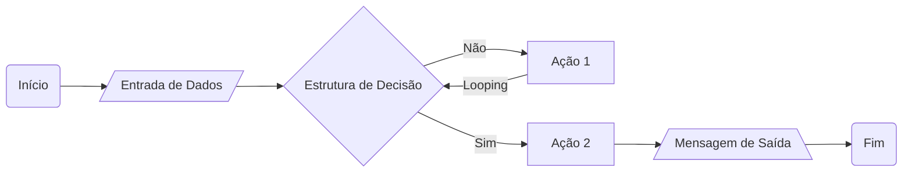
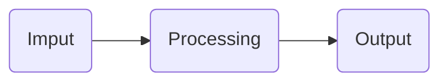

# Materiais Complementares
[Mapa] https://helpful-jump-17b.notion.site/Mapa-de-aventura-91f3e9bd923842149d4dba754dc65c07  
[Artigos DIO] https://web.dio.me/articles  
[Stack Overflow] https://stackoverflow.com  
# Entendendo Algoritmos e Fluxogramas
## Sobre Algoritmos
- **Algorítimos:** são os passo a passo lógicos que o computador precisa executar para resolver um problema.
- A ordem dos fatores **altera** o produto
- A primeira etapa é saber qual problema você quer resolver.
## Fluxogramas
- **Fluxograma:** é uma representação visual de uma sequência de ações.
-  Precisa ter um **início** e um **fim**, por padrão usa-se bordas arredondadas nesses casos.
-  Para **entrada de dados** usa-se um paralelogramo inclinado.
-  Para **estrutura de decisisão** usa-se um losângulo.
-  Para **ações** usa-se um retângulo.
-  Para **mensagens de saída** usa-se um paralelogramo base de pirâmide.

# Estrutura de um Software e seus componentes
**Todo o aplicativo tem esses 3 momentos:**

## Features
Cada **Feature** é uma funcionalidade do programa.  
Cada **Feature** é um fluxo de Imput -> Processing -> Output
## Estrutura do Programa
- **let** usado para declarar uma variável.
- **const** usado para declarar uma constante
- **//** usado para comentar
- **+** usado para concatenar  
*Uma constante não pode ter seu valor alterad0*
## Tipos de Variáveis
- **string:** texto
- **number:** números
- **boolean:** variáveis lógicas que guardam 2 estados (verdadeiro ou falso)
*JavaScript é uma linguágem não tipável (você não precisa declarar o tipo da variável na hora que cria ela)*  
*Na informática, qualquer número que não seja usado para operações deve ser guardado como texto por boa prática*
