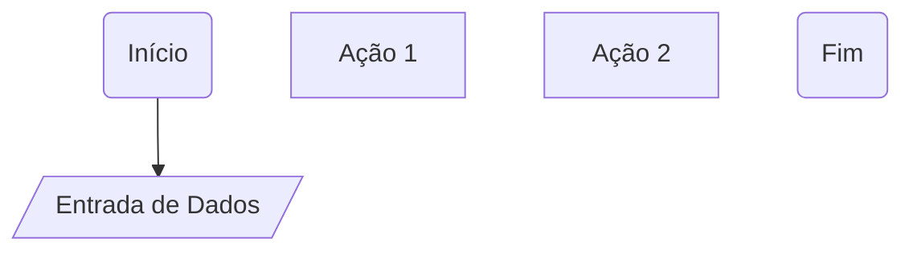

# Materiais Complementares
[Mapa] https://helpful-jump-17b.notion.site/Mapa-de-aventura-91f3e9bd923842149d4dba754dc65c07  
[Artigos DIO] https://web.dio.me/articles  
[Stack Overflow] https://stackoverflow.com  
# Entendendo Algoritmos e Fluxogramas
## Sobre Algoritmos
- **Algorítimos:** são os passo a passo lógicos que o computador precisa executar para resolver um problema.
- A ordem dos fatores **altera** o produto
- A primeira etapa é saber qual problema você quer resolver.
## Fluxogramas
- **Fluxograma:** é uma representação visual de uma sequência de ações.
-  Precisa ter um **início** e um **fim**, por padrão usa-se bordas arredondadas nesses casos.
-  Para **entrada de dados** usa-se um paralelogramo.
-  Para **estrutura de decisisão** usa-se um losângulo.

